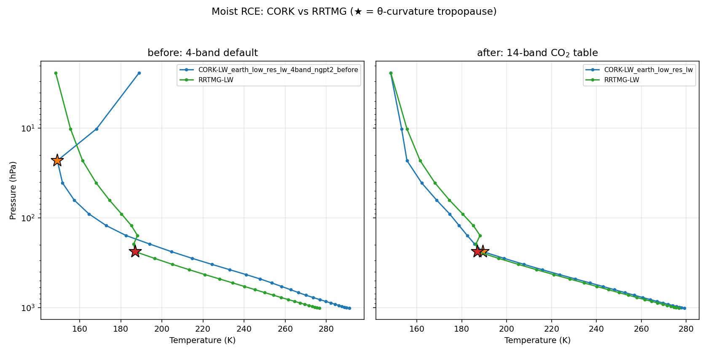
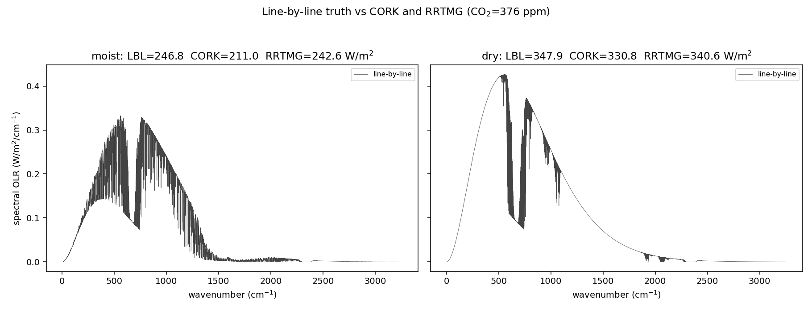
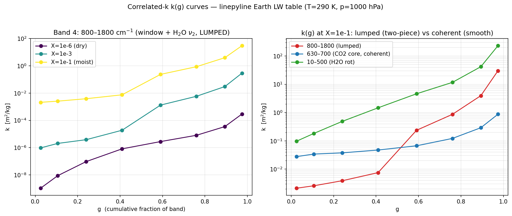
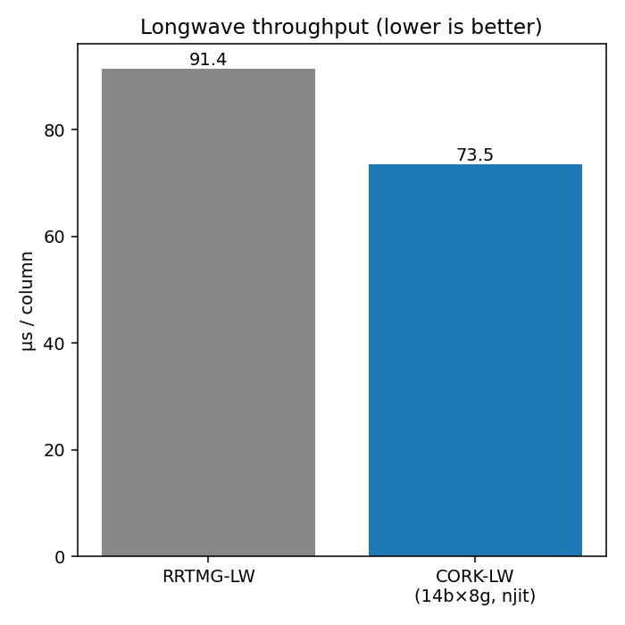

## 1. The symptom

Here is a moist column relaxed to radiative–convective equilibrium (RCE) two
ways: once with RRTMG-LW, the workhorse longwave scheme, and once with climt's
cork longwave (`CorkLongwaveRadiation`) using its first-cut **4-band**
Earth table. Same shortwave, same convection, same surface. Only the longwave
differs.

Look at the left panel. The cork column (blue) is far warmer than RRTMG
(green) through the whole troposphere. The numbers are stark:

| quantity (moist RCE) | 4-band default | vs RRTMG |
|---|---|---|
| surface temperature | **+11.9 K warmer** | runaway |
| surface humidity | 6.48 g/kg | vs 2.02 (≈3× too moist) |
| tropopause (θ-curvature) | ≈23 hPa | vs 238 hPa — nowhere close |

A +12 K surface bias with a humidity runaway is not a tuning problem; it is a
*the scheme is wrong* problem. The detective question for the rest of this post:
**is it the line data, or the scheme?**

## 2. A primer: the k-distribution, and the one assumption it rests on

::: {.callout-note collapse="true"}
## How correlated-k works (expand if it's new)

A longwave band spans many wavenumbers ν, and the gas absorption coefficient
k(ν) varies wildly across it — by orders of magnitude between a transparent gap
and the centre of an absorption line. The band-averaged transmission through a
column of absorber amount $u$ is

$$\mathcal{T}(u) = \big\langle e^{-k(\nu)\,u} \big\rangle_\nu .$$

You **cannot** replace $k(\nu)$ by its mean: the average of an exponential is not
the exponential of the average. Line-by-line integration does it honestly but is
far too expensive for a climate model.

The **k-distribution** trick: that integral only depends on the *distribution* of
k-values in the band, not on where in ν they sit. So sort k(ν) from weakest to
strongest. You get a smooth, monotonic curve $k(g)$, where $g \in [0,1]$ is the
cumulative fraction of the band. A handful of quadrature points on $k(g)$ — the
**g-points** — then integrate the transmission cheaply. Low-g points are the
transparent gaps that radiate to space; high-g points are the saturated line
cores.

The **"correlated"** part is the load-bearing assumption. Stacking many layers
requires that the *rank ordering* of k(ν) is preserved with height — that a given
g-point corresponds to the same wavenumbers at every level. That holds when one
absorber, scaling smoothly with pressure and temperature, dominates the band.
:::

Keep that last assumption in mind. It is exactly what will break.

## 3. Isolating the culprit

The clean way to split "line data" from "scheme" is to compare against
**line-by-line** truth — the absorption computed wavenumber by wavenumber, with no
k-distribution approximation at all.

The line-by-line total matches RRTMG. The cork scheme, fed the *same*
line data, traps more — its outgoing longwave is too low. The line data is fine.
**The correlated-k scheme is the culprit.** Now we have to find out where inside
it the error lives.

## 4. The dead-ends (this is the useful part)

The obvious instinct is that the scheme is under-resolved. It isn't, and watching
the obvious fixes fail is how you learn what the problem actually is.

::: {.callout-warning}
## What did *not* work

- **More g-points (8 → 16 → 32).** The over-trapping barely moves. If this were a
  quadrature-resolution problem, more g-points would fix it. They don't.
- **Finer vertical resolution.** Same story — no help.
- **Boosting the line wings.** A hack; rejected.

When throwing resolution at an error doesn't move it, you are not fighting a
numerical problem. You are fighting a **structural** assumption — here, the
correlated-k spectral-correlation floor. That reframing is what points at the two
real levers below.
:::

## 5. Root cause #1 — the water-vapour continuum (the dominant moist lever)

The H₂O continuum [@mlawer2012] is a broad, slowly varying absorption that rides
underneath the lines. The first-cut table folded it *into* the line-sorted
k-distribution and interpolated it linearly across log-spaced humidity nodes.
Because the continuum scales roughly with the square of water-vapour amount,
linear interpolation across log-spaced nodes systematically over-shoots — and it
over-traps by about **17 W/m²** in the moist column.

::: {.callout-tip}
## The fix (engineering)

Decouple it. Build the k-distribution from the **lines only**, and carry the
continuum as a separate, band-grey term interpolated in log-X. This is precisely
the separation RRTMG uses — its `tauself` / `taufor` self- and foreign-continuum
paths [@mlawer1997]. Same physics, split into the two pieces that each
interpolate cleanly.
:::

## 6. Root cause #2 — band structure (the lumped window)

The second lever is the one the primer warned about. The 4-band table lumps the
entire 800–1800 cm⁻¹ region into a single band — but that region contains **two
spectrally distinct populations**: the transparent 8–12 µm window, and the opaque
H₂O ν₂ band. Sort them together and you get the tell-tale shape:

That shelf-and-cliff is the fingerprint of two populations in one band. One shared
Planck weight and one shared set of g-points cannot represent both at once, so the
transparent half can't open up and gets over-absorbed. Notice the error is
**invisible when dry** (both halves are transparent) and switches on with water
vapour — exactly the dry/moist signature we measured.

The fix is surgical: a **14-band** partition that isolates the window and refines
the far-IR and ν₂ regions, so each band is again a single coherent population.

## 7. The payoff — and which diagnostic to trust

Put both fixes together — decoupled continuum + 14-band structure — and re-run the
same moist RCE (the right panel of the first figure):

| quantity (moist RCE vs RRTMG) | 4-band | 14-band |
|---|---|---|
| surface temperature | +11.9 K | **+2.0 K** |
| dry surface temperature | — | +0.8 K |
| surface humidity | 6.48 vs 2.02 g/kg | 2.38 vs 2.02 |
| tropopause (θ-curvature) | 23 hPa vs RRTMG 238 | **238 hPa — co-located** |

The warm runaway is gone, the humidity is sane, and the cork tropopause
now sits right on top of RRTMG's.

::: {.callout-tip}
## A diagnostic that survives a broken climate

Locating the tropopause turned out to need its own work. The simple "potential
temperature exceeds the surface value by 10 K" marker mislocated the runaway
column badly — it reported a tropopause near **583 hPa**, deep in the
mid-troposphere, which is physically nonsense. This post instead uses a
**θ-curvature** criterion: the tropopause is the kink where potential temperature
stops being convectively well-mixed and shoots up into the stratosphere — the
level of maximum |d²θ/d(ln p)²|. It locates the well-behaved 14-band column at
238 hPa (matching RRTMG) and correctly reports the broken 4-band column as
pathological — convection driven absurdly deep, tropopause near 23 hPa. You can
read it in `scripts/experiments/tropopause.py`.
:::

::: {.callout-note}
## Which error metric should you believe?

There's a trap here worth internalising. A **fixed-profile** single-column
comparison reads about +11 W/m² of over-trapping for *both* the prototype and the
shipped 14-band table — it looks like the band work barely helped. Yet the
self-adjusting RCE column converges to only ~2 K. The fixed-profile metric
**over-states** the error a column that can adjust its own humidity and lapse rate
actually incurs. Always match the diagnostic to the question you're asking.
:::

## 8. Two more things this bought us

**Fast vs faithful.** Making the table faithful — 14 bands, 8 g-points, a runtime
CO₂ axis — made the *Python* optical-depth and Planck assembly the bottleneck, not
the physics. Compiling the two hot loops with Numba's `@njit(parallel=True)` (on
top of the already-compiled transport kernel) recovered all of it, bit-for-bit:

The faithful scheme ends up **faster than RRTMG** — 73.5 against 91.4 µs/column
in the run the figure above was built from, a ratio of 0.80. Your absolute numbers
will vary with machine, thread count and column count; it is the ratio that
carries the point, and the notebook alongside this page records a different
machine at 52.9 against 63.3. The lesson is that accuracy and speed were never the
trade-off — the cost was un-compiled assembly loops.

**The free knob.** The same table is CO₂-adjustable from 10 to 10 000 ppm through
a single runtime axis, interpolated geometrically (log-k against log-X_CO₂).
Interpolating CO₂ *between* table nodes turns out to be fidelity-free: the
off-node bias against line-by-line equals the on-node bias. (A leave-one-out test
puts log-k interpolation at 5.5 % vs 30.9 % for linear-k.) The probe lives in
`scripts/experiments/eval_co2_interp_accuracy.py`.

## 9. The answer key

The shipped recipe, for reference:

- **14 bands**, edges (cm⁻¹): `10, 250, 350, 500, 630, 700, 800, 980, 1080, 1180,
  1250, 1400, 1600, 1800, 3250`; **8 g-points** per band.
- **Line-only** k-distribution + a **decoupled band-grey H₂O continuum**, log-X
  interpolated.
- A runtime **CO₂ axis** (10 log nodes, 10–10 000 ppm).
- Quadrilinear interpolation: T (linear), log p (linear), log X_H₂O (linear-k),
  log X_CO₂ (**log-k**).

The cork optics follow the analytic non-grey framework of
@parmentier2014; the table ships as `earth_low_res_lw`, with the original 4-band
table preserved as `earth_low_res_lw_4band_ngpt2_before` for the before/after
comparison above.

## Try it yourself

Every figure and number above is reproduced by the companion notebook, which
loads the same regenerated artifacts and re-runs the analysis. Run it in the
`climt` environment, or read it through here:


