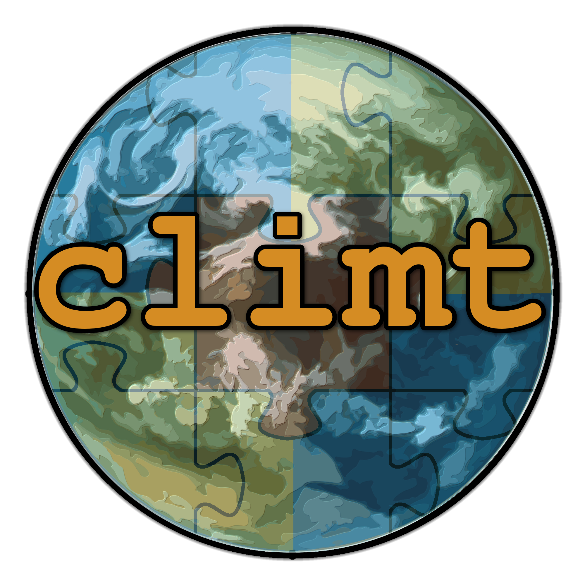

```{=html}
<style>
/* ============================================================
   climt landing page — self-contained.
   Tokens inlined from the climt design system (tokens/*.css),
   scoped to .climt-home so this page is independent of Bootstrap.
   ============================================================ */
.climt-home {
  /* color */
  --ochre-50:#fdf6ea; --ochre-100:#f9e8c9; --ochre-200:#f2d093; --ochre-300:#ebb85f;
  --ochre-500:#d98a2b; --ochre-600:#bd7220; --ochre-700:#97591b;
  --ocean-50:#eef4f9; --ocean-200:#a6c6df; --ocean-300:#74a4c9; --ocean-500:#3e6e96; --ocean-600:#2c5378; --ocean-700:#234461;
  --sage-50:#f3f5ec; --sage-200:#c7d0a6; --sage-300:#aab87b; --sage-500:#7e8b53;
  --clay-50:#fbf0ea; --clay-200:#e6b095; --clay-500:#b5532e;
  --sand-50:#faf3e6; --sand-100:#f3ebda; --sand-200:#e8dfcd; --sand-300:#d6c9b0;
  --sand-400:#b3a587; --sand-500:#8d8068; --sand-800:#34302a; --sand-900:#211e1a; --white:#fff;

  --brand:var(--ochre-500); --brand-hover:var(--ochre-600);
  --surface-page:var(--sand-50); --surface-raised:var(--white);
  --surface-sunken:var(--sand-100); --surface-inverse:var(--sand-900);
  --text-strong:var(--sand-900); --text-body:var(--sand-800); --text-muted:var(--sand-600,#6b6051);
  --border-subtle:var(--sand-200); --code-bg:var(--sand-900);

  /* type */
  --font-display:'IBM Plex Sans',system-ui,-apple-system,'Segoe UI',sans-serif;
  --font-sans:'IBM Plex Sans',system-ui,-apple-system,'Segoe UI',sans-serif;
  --font-mono:'JetBrains Mono','SF Mono','Fira Mono',ui-monospace,monospace;

  /* space */
  --space-2:.5rem; --space-3:.75rem; --space-4:1rem; --space-5:1.5rem; --space-6:2rem;
  --space-7:2.5rem; --space-8:3rem; --space-9:4rem; --space-10:5rem; --space-12:6rem;
  --container-md:820px; --container-lg:1080px;

  /* radii / shadow */
  --radius-sm:8px; --radius-md:12px; --radius-xl:24px; --radius-pill:999px;
  --shadow-md:0 4px 12px rgba(33,30,26,.08),0 2px 4px rgba(33,30,26,.05);
  --shadow-xl:0 24px 52px rgba(33,30,26,.16),0 8px 16px rgba(33,30,26,.08);

  font-family:var(--font-sans);
  color:var(--text-body);
  background:var(--surface-page);
  line-height:1.6;
  -webkit-font-smoothing:antialiased;
}
/* paint the page body so Bootstrap's white never bleeds through behind the custom layout */
html,body.quarto-light,body{background:#faf3e6;}
/* hide Quarto's own navbar + title block — this stylesheet only loads on the home page,
   so the chrome is suppressed here while the docs pages keep theirs. The page renders
   its own branded <nav> below. */
#quarto-header,nav.navbar,.navbar,#title-block-header,header#title-block-header,.quarto-title-block{display:none!important;}
body{padding-top:0!important;margin-top:0!important;}
.climt-home{min-height:100vh;}
.climt-home *,.climt-home *::before,.climt-home *::after{box-sizing:border-box;}
.climt-home h1,.climt-home h2,.climt-home h3{font-family:var(--font-display);color:var(--text-strong);margin:0;}

/* nav */
.climt-home .ch-nav{position:sticky;top:0;z-index:20;height:60px;display:flex;align-items:center;
  gap:var(--space-5);padding:0 var(--space-6);background:rgba(251,248,242,.85);
  backdrop-filter:saturate(180%) blur(12px);border-bottom:1px solid var(--border-subtle);}
.climt-home .ch-nav .brand{display:flex;align-items:center;gap:10px;}
.climt-home .ch-nav .brand img{width:34px;height:34px;border-radius:50%;}
.climt-home .ch-nav .brand span{font-family:var(--font-display);font-weight:600;font-size:1.75rem;color:var(--text-strong);}
.climt-home .ch-nav .links{margin-left:auto;display:flex;gap:var(--space-5);align-items:center;}
.climt-home .ch-nav a.l{color:var(--text-muted);font-weight:600;font-size:.875rem;text-decoration:none;}
.climt-home .ch-nav a.l:hover{color:var(--text-strong);}

/* hero */
.climt-home .hero{position:relative;overflow:hidden;padding:var(--space-12) var(--space-6) var(--space-10);
  background:radial-gradient(120% 90% at 80% 0%,var(--ochre-50) 0%,var(--surface-page) 55%);}
.climt-home .hero-grid{max-width:var(--container-lg);margin:0 auto;display:grid;
  grid-template-columns:1.1fr .9fr;gap:var(--space-9);align-items:center;}
.climt-home .hero h1{font-weight:600;font-size:4rem;line-height:1.1;letter-spacing:-.02em;margin:0 0 var(--space-4);}
.climt-home .hero h1 .py{color:var(--brand);}
.climt-home .hero .lead{font-size:1.125rem;line-height:1.75;color:var(--text-body);max-width:52ch;margin-bottom:var(--space-6);}
.climt-home .hero-art{display:grid;place-items:center;}
.climt-home .hero-art img{width:320px;height:320px;border-radius:50%;box-shadow:var(--shadow-xl);}
.climt-home .badge-row{display:flex;gap:8px;margin-bottom:var(--space-4);}
.climt-home .cta-row{display:flex;gap:12px;align-items:center;margin-bottom:var(--space-5);}
.climt-home .install{display:inline-flex;align-items:center;gap:12px;padding:10px 16px;
  background:var(--code-bg);border-radius:var(--radius-sm);font-family:var(--font-mono);
  font-size:.875rem;color:var(--sand-100);}
.climt-home .install .dollar{color:var(--sage-300);}
.climt-home .install .copy{color:var(--sand-500);margin-left:8px;cursor:pointer;}

/* badges */
.climt-home .badge{display:inline-flex;align-items:center;gap:6px;font-family:var(--font-sans);
  font-weight:600;font-size:.75rem;padding:3px 10px;border-radius:var(--radius-pill);white-space:nowrap;}
.climt-home .badge .dot{width:6px;height:6px;border-radius:50%;background:currentColor;}
.climt-home .badge.brand{background:var(--ochre-100);color:var(--ochre-700);}
.climt-home .badge.ocean-outline{background:transparent;color:var(--ocean-600);border:1px solid var(--ocean-200);}
.climt-home .badge.sage{background:var(--sage-50);color:var(--sage-500);border:1px solid var(--sage-200);}

/* buttons */
.climt-home .btn{display:inline-flex;align-items:center;gap:8px;font-family:var(--font-sans);
  font-weight:600;font-size:1rem;padding:12px 22px;border-radius:var(--radius-sm);
  text-decoration:none;cursor:pointer;border:1px solid transparent;transition:all .16s cubic-bezier(.4,0,.2,1);}
.climt-home .btn.primary{background:var(--brand);color:var(--white);}
.climt-home .btn.primary:hover{background:var(--brand-hover);}
.climt-home .btn.secondary{background:var(--surface-raised);color:var(--text-strong);border-color:var(--border-subtle);}
.climt-home .btn.secondary:hover{border-color:var(--sand-400);}

/* features */
.climt-home .features{padding:var(--space-10) var(--space-6);max-width:var(--container-lg);margin:0 auto;}
.climt-home .eyebrow{font-family:var(--font-sans);font-weight:700;font-size:.6875rem;text-transform:uppercase;
  letter-spacing:.12em;color:var(--ochre-600);margin-bottom:8px;}
.climt-home .features .head{text-align:center;margin-bottom:var(--space-8);}
.climt-home .features h2{font-size:2.25rem;}
.climt-home .cards{display:grid;grid-template-columns:repeat(4,1fr);gap:var(--space-4);}
.climt-home .card{background:var(--surface-raised);border:1px solid var(--border-subtle);
  border-radius:var(--radius-md);padding:var(--space-5);box-shadow:var(--shadow-md);position:relative;
  overflow:hidden;transition:transform .16s cubic-bezier(.4,0,.2,1);}
.climt-home .card:hover{transform:translateY(-3px);}
.climt-home .card::before{content:"";position:absolute;top:0;left:0;right:0;height:4px;background:var(--rail);}
.climt-home .card.brand{--rail:var(--ochre-500);}
.climt-home .card.ocean{--rail:var(--ocean-500);}
.climt-home .card.sage{--rail:var(--sage-500);}
.climt-home .card.clay{--rail:var(--clay-500);}
.climt-home .card h3{font-family:var(--font-sans);font-weight:600;font-size:1.375rem;margin:0 0 8px;}
.climt-home .card p{margin:0;font-size:.875rem;color:var(--text-muted);line-height:1.55;}

/* code showcase */
.climt-home .showcase{padding:var(--space-10) var(--space-6);background:var(--surface-sunken);}
.climt-home .showcase-grid{max-width:var(--container-md);margin:0 auto;display:grid;
  grid-template-columns:.85fr 1.15fr;gap:var(--space-8);align-items:center;}
.climt-home .showcase h2{font-size:2.25rem;margin:0 0 var(--space-3);}
.climt-home .showcase p{color:var(--text-body);margin-bottom:var(--space-4);}
.climt-home .codeblock{background:var(--code-bg);border-radius:var(--radius-md);overflow:hidden;box-shadow:var(--shadow-md);}
.climt-home .codeblock .bar{display:flex;align-items:center;gap:8px;padding:10px 14px;
  border-bottom:1px solid #34302a;font-family:var(--font-mono);font-size:.75rem;color:var(--sand-400);}
.climt-home .codeblock .bar .fname{margin-left:4px;}
.climt-home .codeblock pre{margin:0;padding:16px 18px;overflow-x:auto;}
.climt-home .codeblock code{font-family:var(--font-mono);font-size:.875rem;line-height:1.65;color:var(--sand-100);}
.climt-home .codeblock .k{color:var(--ochre-300);}
.climt-home .codeblock .fn{color:var(--ocean-300);}
.climt-home .codeblock .cm{color:var(--sand-500);}

/* footer */
.climt-home .foot{background:var(--surface-inverse);color:var(--sand-300);
  padding:var(--space-9) var(--space-6) var(--space-7);}
.climt-home .foot-grid{max-width:var(--container-lg);margin:0 auto;display:flex;
  justify-content:space-between;align-items:flex-start;gap:var(--space-8);flex-wrap:wrap;}
.climt-home .foot .blurb{max-width:320px;}
.climt-home .foot .blurb .brand{display:flex;align-items:center;gap:10px;margin-bottom:12px;}
.climt-home .foot .blurb .brand img{width:36px;height:36px;border-radius:50%;}
.climt-home .foot .blurb .brand span{font-family:var(--font-display);font-weight:600;font-size:1.75rem;color:var(--white);}
.climt-home .foot .blurb p{font-size:.875rem;color:var(--sand-400);line-height:1.6;margin:0;}
.climt-home .foot .cols{display:flex;gap:var(--space-9);}
.climt-home .foot .cols h4{font-family:var(--font-sans);font-weight:700;font-size:.6875rem;text-transform:uppercase;
  letter-spacing:.12em;color:var(--sand-500);margin:0 0 12px;}
.climt-home .foot .cols a{display:block;font-size:.875rem;color:var(--sand-300);margin-bottom:8px;text-decoration:none;}
.climt-home .foot .cols a:hover{color:var(--white);}

@media (max-width:860px){
  .climt-home .hero-grid,.climt-home .showcase-grid{grid-template-columns:1fr;}
  .climt-home .hero-art{order:-1;}
  .climt-home .hero h1{font-size:2.75rem;}
  .climt-home .cards{grid-template-columns:repeat(2,1fr);}
}
@media (prefers-reduced-motion:reduce){.climt-home *{transition:none!important;}}
</style>

<div class="climt-home">

  <nav class="ch-nav">
    <span class="brand">
      
      <span>climt</span>
    </span>
    <span class="links">
      <a class="l" href="get-started/quickstart.html">Docs</a>
      <a class="l" href="user-guide/introduction.html">User Guide</a>
      <a class="l" href="experiments/index.html">Experiments</a>
      <a class="l" href="https://github.com/CliMT/climt">GitHub ↗</a>
    </span>
  </nav>

  <section class="hero">
    <div class="hero-grid">
      <div>
        <div class="badge-row">
          <span class="badge brand"><span class="dot"></span>v0.9.4 · BSD licensed</span>
          <span class="badge ocean-outline">units-aware</span>
        </div>
        <h1>Build Earth-system models in <span class="py">Python</span>.</h1>
        <p class="lead">climt is a Climate Modelling and Diagnostics Toolkit — a modular, intuitive way to write
          numerical models of the climate system. State-of-the-art components, no Fortran required.</p>
        <div class="cta-row">
          <a class="btn primary" href="get-started/quickstart.html">Get started <span>→</span></a>
          <a class="btn secondary" href="get-started/quickstart.html">Read the docs</a>
        </div>
        <div class="install">
          <span class="dollar">$</span>
          <span>pip install climt</span>
          <span class="copy" title="copy">⧉</span>
        </div>
      </div>
      <div class="hero-art">
        
      </div>
    </div>
  </section>

  <section class="features">
    <div class="head">
      <div class="eyebrow">Why climt</div>
      <h2>Modelling, made composable</h2>
    </div>
    <div class="cards">
      <div class="card brand">
        <h3>Plug-and-play</h3>
        <p>Mix and match independent physical components — radiation, convection, surface — into a model. No rewrites between levels of complexity.</p>
      </div>
      <div class="card ocean">
        <h3>Units-aware</h3>
        <p>Built on sympl and Pint. Every quantity carries its units; xarray DataArrays make model arrays self-describing.</p>
      </div>
      <div class="card sage">
        <h3>Self-documenting</h3>
        <p>Descriptive names in the user API mean model scripts read like prose — reproducible and easy to learn.</p>
      </div>
      <div class="card clay">
        <h3>State of the art</h3>
        <p>RRTMG radiation, Emanuel convection, correlated-k schemes — research-quality components, accessible to students.</p>
      </div>
    </div>
  </section>

  <section class="showcase">
    <div class="showcase-grid">
      <div>
        <h2>A model in five lines</h2>
        <p>Create components, allocate a state, and run. The defaults are scientifically meaningful,
          so your first model does something sensible immediately.</p>
        <div class="badge-row">
          <span class="badge sage"><span class="dot"></span>scientifically-sane defaults</span>
        </div>
      </div>
      <div class="codeblock">
        <div class="bar"><span>●</span><span class="fname">first_model.py</span></div>
        <pre><code><span class="k">import</span> climt

radiation = climt.<span class="fn">GrayLongwaveRadiation</span>()
surface   = climt.<span class="fn">SlabSurface</span>()

state = climt.<span class="fn">get_default_state</span>([radiation, surface])
tendencies, diagnostics = <span class="fn">radiation</span>(state)</code></pre>
      </div>
    </div>
  </section>

  <footer class="foot">
    <div class="foot-grid">
      <div class="blurb">
        <div class="brand">
          
          <span>climt</span>
        </div>
        <p>Climate Modelling and Diagnostics Toolkit. Free software, BSD licensed. Built on sympl.</p>
      </div>
      <div class="cols">
        <div>
          <h4>Docs</h4>
          <a href="get-started/quickstart.html">Quickstart</a>
          <a href="user-guide/introduction.html">User Guide</a>
          <a href="api/index.html">API Reference</a>
        </div>
        <div>
          <h4>Project</h4>
          <a href="https://github.com/CliMT/climt">GitHub</a>
          <a href="https://pypi.org/project/climt/">PyPI</a>
          <a href="#">Zenodo DOI</a>
        </div>
        <div>
          <h4>Learn</h4>
          <a href="radiative-transfer/index.html">Radiative Transfer</a>
          <a href="experiments/index.html">Experiments</a>
          <a href="#">Citing climt</a>
        </div>
      </div>
    </div>
  </footer>

</div>
```
